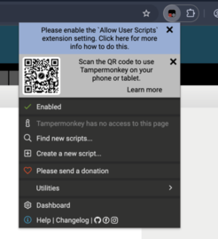
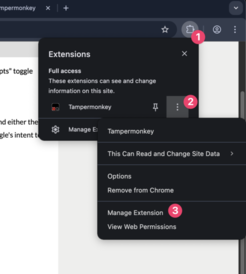
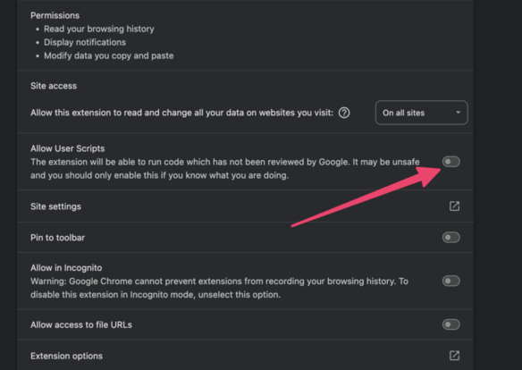

# Tổng hợp Redmine cho dự án Script Helper

## 1. Giới thiệu chung project

Project này gồm các helper script dùng cho môi trường web nội bộ `http://192.168.50.14:81/*`.
Mục tiêu chính:
- hỗ trợ dịch nhanh từ tiếng Nhật sang tiếng Việt
- quản lý từ điển dịch và alias cho các file domain
- tô màu biến/thuộc tính trong bảng method
- phát hiện thay đổi iframe `frSheet` và cập nhật lại nội dung

Các file chính hiện có:
- `translate/domain-helper.js` — quản lý dictionary, hiển thị tooltip, form chỉnh sửa alias
- `translate/tab-helper.js` — dialog dịch nhanh trên tab / iframe
- `variable-maker-color/color-helper.js` — parse bảng method và tô màu biến, attribute

## 2. Hướng dẫn cài đặt extension **Tampermonkey**hoặc **Script Cat**

### Bước 1: Cài đặt Tampermonkey extension

**Tải Tampermonkey**: [https://www.tampermonkey.net/](https://www.tampermonkey.net/)
**Tải Tampermonkey**: [https://docs.scriptcat.org/](https://docs.scriptcat.org/)

Hoặc dùng các link tải trực tiếp dưới đây:

- **Google Chrome / Microsoft Edge / Cốc Cốc**: Cài đặt từ [Chrome Web Store](https://chromewebstore.google.com/detail/tampermonkey/dhdgffkkebhmkfjojejmpbldmpobfkfo).
- **Mozilla Firefox**: Cài đặt từ [Firefox Add-ons](https://addons.mozilla.org/vi/firefox/addon/tampermonkey/).

#### Lưu ý với người lần đầu cài đặt Tampermonkey

Lần đầu cài đặt Tampermonkey, ở icon của Tampermonkey sẽ hiện ra một cái chữ "X" đỏ, bạn cần thao tác khác để kích hoạt Tampermonkey.

- Bấm vào icon của Tampermonkey.
- Chọn dấu 3 chấm hoặc chuột phải vào icon của Tampermonkey.
- Chọn "Manage Extension" (Quản lý).

- Bật Allow Userscripts

Hướng dẫn chi tiết hơn [tại đây](https://www.tampermonkey.net/faq.php?q=Q209#Q209).

### Bước 2: Cài đặt helper cho **Tampermonkey**, **Script Cat** extension
1. Mở app Userscripts lên rồi đóng.
2. Mở trình duyệt Safari và truy cập vào link
- Mở [`translate/domain-helper.user.js`](https://nsvn-tranminhhoang.github.io/helper-coder-read-domain/translate/domain-helper.user.js)
- Mở [`translate/tab-helper.user.js`](https://nsvn-tranminhhoang.github.io/helper-coder-read-domain/translate/domain-helper.user.js)
- Mở [`variable-maker-color/color-helper.user.js`](https://nsvn-tranminhhoang.github.io/helper-coder-read-domain/variable-maker-color/color-helper.user.js)
4. Ấn lưu
## 4. Cách sử dụng

### 4.1 Sử dụng chức năng ghi chú
- Trong giao diện web http://192.168.50.14:81/,
- Tooltip dịch sẽ hiện nếu có alias trong `localStorage`.
- Nếu chưa có alias, mở popup để nhập và lưu.

### 4.2 Dùng panel Dictionary Manager
- Nhấn đúp vào button `VI` ở góc dưới cùng để mở panel chính.
- Tìm kiếm từ tiếng Nhật hoặc alias.
- Chỉnh sửa alias, xóa, xuất / nhập dictionary.

### 4.3 Quản lý alias class, attribute và method
- Mở `Script Cat` hoặc form quản lý class trong phần `#index-files`.
- Nhập `alias` cho class.
- Nhập `alias` các attributes, methods class.
- Bấm `Lưu` để ghi vào `localStorage`.
